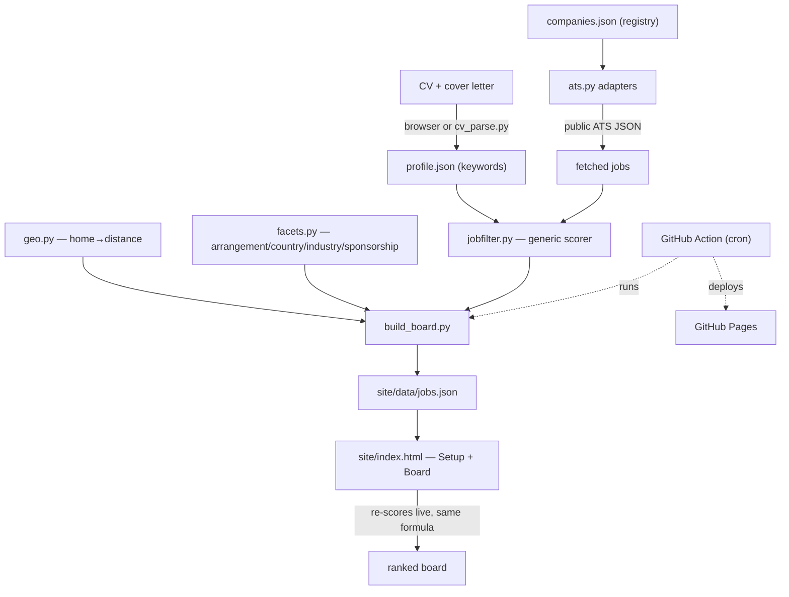
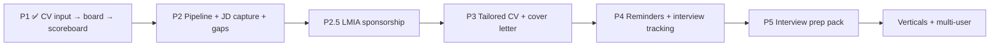
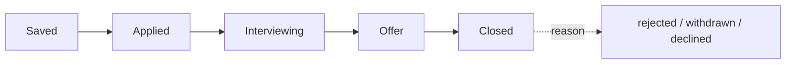

# Diagrams
GitHub renders these Mermaid blocks as pictures. (Also render in the Claude preview.)

## 1. Architecture / data flow

```mermaid
flowchart TD
  CV["CV + cover letter"] -->|browser or cv_parse.py| PROF["profile.json (keywords)"]
  REG["companies.json (registry)"] --> FETCH["ats.py adapters"]
  FETCH -->|public ATS JSON| POOL["fetched jobs"]
  PROF --> SCORE["jobfilter.py — generic scorer"]
  POOL --> SCORE
  GEO["geo.py — home→distance"] --> BUILD
  FAC["facets.py — arrangement/country/industry/sponsorship"] --> BUILD
  SCORE --> BUILD["build_board.py"]
  BUILD --> DATA["site/data/jobs.json"]
  DATA --> SITE["site/index.html — Setup + Board"]
  SITE -->|re-scores live, same formula| USER["ranked board"]
  ACT["GitHub Action (cron)"] -.runs.-> BUILD
  ACT -.deploys.-> PAGES["GitHub Pages"]
```

## 2. Phase roadmap

```mermaid
flowchart LR
  P1["P1 ✅ CV input → board → scoreboard"] --> P2["P2 Pipeline + JD capture + gaps"]
  P2 --> P25["P2.5 LMIA sponsorship"]
  P25 --> P3["P3 Tailored CV + cover letter"]
  P3 --> P4["P4 Reminders + interview tracking"]
  P4 --> P5["P5 Interview prep pack"]
  P5 --> V["Verticals + multi-user"]
```

## 3. Pipeline stages (Phase 2)

```mermaid
flowchart LR
  Saved --> Applied --> Interviewing --> Offer --> Closed
  Closed -.reason.-> R["rejected / withdrawn / declined"]
```
