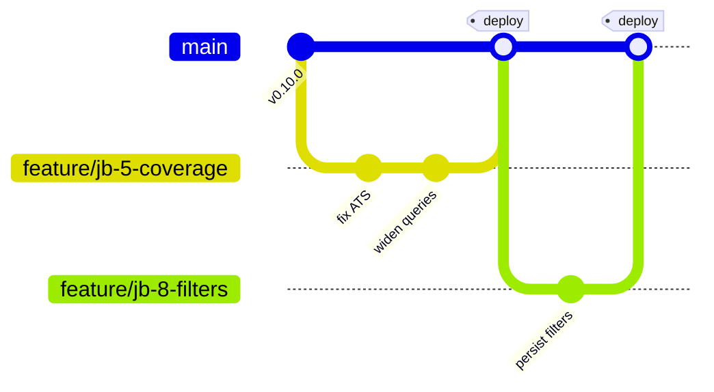
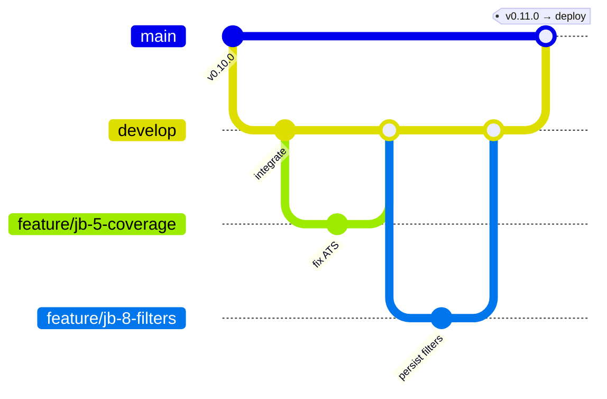
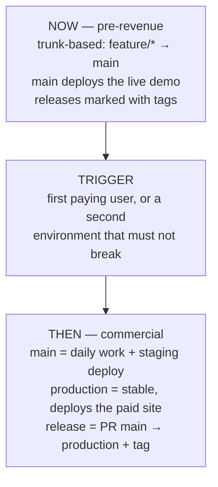

# ADR-001 — Branching model (and the road to a production branch)

- **Status:** ACCEPTED
- **Date:** 2026-09-18
- **Deciders:** BT (owner)
- **Supersedes:** the flow described in `BRANCHING.md` (which does not match reality)

---

## 1. Context — why we are deciding this now

Three facts forced this decision:

1. **The documented workflow is fiction.** `BRANCHING.md` says work flows
   `feature/* → develop → main`. The git history says otherwise: PRs #26, #29, #31,
   #34 and #35 all merged **straight into `main`**. `origin/develop` is **0 commits
   ahead of main and 14 behind**, untouched since 2026-09-16.
2. **The docs contradict each other.** `CLAUDE.md` instructs "pull main → branch
   `feature/jb-NN-slug`" (branch off *main*), while `BRANCHING.md` says branch off
   *develop*. Both cannot be right.
3. **A new requirement arrived:** a **production branch for commercialisation** —
   a stable branch that future paying users are served from, insulated from daily work.

A workflow nobody follows is worse than no workflow, because it trains you to ignore
your own documentation. So we reconcile the docs with reality *and* with where the
product is going.

### The constraint that shapes everything

`.github/workflows/sweep.yml` deploys on **every push to `main`**:

```yaml
on:
  push:
    branches: [main]
```

So today **`main` IS the live site**. Anything merged to main is instantly public.
That single line is why the branching choice matters at all.

---

## 2. Git concepts this decision relies on

Worth understanding before choosing, because the models differ only in how they use these.

| Concept | What it actually is |
|---|---|
| **Branch** | Just a movable label pointing at a commit. Creating one is free and instant — it copies nothing. This is why "one branch per issue" costs nothing. |
| **Pull Request** | A GitHub feature, not a git one. It's a request to merge a branch, plus a place to review, run checks, and discuss before it lands. |
| **Branch protection** | A GitHub rule on a branch: e.g. "no direct pushes, PR required, tests must pass." This is what actually *enforces* a workflow — docs only describe it. |
| **Tag** | A permanent label on one commit (`v0.10.0`). Unlike a branch it never moves. Tags are how you mark releases. |
| **Long-lived branch** | A branch that never gets deleted (`main`, `develop`). Every one you keep is a branch you must keep in sync forever — this is the real cost of git-flow. |

---

## 3. Option A — Trunk-based (`feature/* → main`)

One long-lived branch. Each issue gets a short branch that lives a day or two, merges, and is deleted.



**The daily loop**

```
git checkout main && git pull
git checkout -b feature/jb-NN-slug
# ...work, commit...
git push -u origin feature/jb-NN-slug
# open PR on GitHub → checks go green → Squash and merge → delete branch
```

**Strengths**
- Matches what you already do, and matches `CLAUDE.md`.
- One branch to keep straight. Nothing to "keep in sync."
- Short-lived branches mean small diffs and near-zero merge conflicts.
- Safety comes from **branch protection + CI**, not from an extra branch.

**Weaknesses**
- With deploy-on-merge, **every merge is a public release**. You cannot batch changes
  or hold a finished feature back without a feature flag.
- No natural staging environment.

**What breaks it:** merging something half-finished. The protection against that is
required status checks, not ceremony.

---

## 4. Option B — Git-flow (`feature/* → develop → main`)

Two long-lived branches. `develop` integrates work; `main` only moves at a release.



**Strengths**
- `main` moves only when *you* decide, so the live site changes on your schedule.
- `develop` is a natural staging branch — several features can land and be tested together.
- Releases become deliberate, versioned events rather than a side effect of merging.

**Weaknesses**
- **Two merges for every change** instead of one, and every long-lived branch is one
  you must keep in sync forever. `develop` drifting 14 commits behind `main` is
  exactly this failure mode — and it already happened here once.
- The benefit is *batching releases for a team*. With one developer and no customers,
  you pay the cost and collect none of the benefit.

**What breaks it:** `develop` and `main` diverging. Which is precisely why it died here.

---

## 5. Option C — Trunk-based now, production branch when it earns its place

The honest synthesis, given the commercialisation requirement.

The requirement is real, but it is a requirement about **environments**, not about
branches. There are two ways to get a stable production target:

| Mechanism | Cost | When it fits |
|---|---|---|
| **Release tags** — main always deployable; production deploys a *tag* (`v1.0.0`), not the tip | Near zero. No second branch to sync. | Before you have paying users |
| **A `production` branch** — a second long-lived branch with its own deploy | One extra merge per release, forever | Once real users are served and you need hotfixes separate from daily work |

**The staged plan**



Adopting the production branch later costs one command:

```bash
git checkout -b production main && git push -u origin production
```

That is the whole migration. **Nothing is lost by waiting, and a lot of daily overhead
is avoided.** Meanwhile tags give you every rollback point you'd want.

Critically, Option C is **not** "ignore the commercialisation requirement." It is:
design the workflow so the production branch drops in cleanly, and add it at the moment
it starts paying for itself rather than 6 months early.

---

## 6. Recommendation

**Adopt Option C**: trunk-based today, with the production branch specified now and
introduced at a named trigger.

Reasoning:

- You are one developer with one user (yourself). Git-flow's entire value is coordinating
  many developers around batched releases; neither condition holds yet.
- `develop` already died once under exactly this workflow. Reviving a branch that failed,
  before the conditions that justify it exist, repeats the mistake.
- The live site today is a **demo**, not a product. A demo updating on merge is correct.
  The moment it stops being a demo, the trigger fires and we add `production`.
- What actually protects the live site is **branch protection + CI running the 41 tests
  and 11 smoke checks on every PR** — which does not exist yet. That is the real gap,
  and it is worth far more than a second branch.

The genuine argument for Option B: if you want the live URL frozen while you work —
for example to show it to someone at a stable state — then `develop` earns its keep
immediately. That is a legitimate reason to choose B now.

---

## 7. Consequences (once decided)

**Adopted:**
- One branch per issue: `feature/jb-NN-slug`, `bugfix/jb-NN-slug`, `hotfix/*`.
- Every change reaches `main` through a PR that closes an issue (`Closes #NN`).
- Branches are deleted after merge.
- `main` protected: PR required, tests required, no direct pushes.
- CI runs `pytest tests/ -q` and `engine/smoke_test.py` on every PR.
- Releases tagged per `VERSIONING.md`; `production` added at the named trigger.

**Given up:**
- Batched releases until `production` exists.
- Holding finished work back without a feature flag.

**Follow-up actions:**
1. Rewrite `BRANCHING.md` to match the decision; reconcile with `CLAUDE.md`.
2. Delete the 7 fully-merged branches and `develop`; delete `feature/jb-3b-ledc-scraper` only after PR #36 merges.
3. Add `.github/workflows/ci.yml` — tests + smoke on every PR.
4. Enable branch protection on `main`.
5. Create the GitHub Project board (`docs/project/GITHUB_PROJECT_SETUP.md`).
6. Add `.gitattributes` to stop CRLF churn polluting diffs.

---

## 8. Decision

**Option C adopted — 2026-09-18.** Trunk-based now; production branch specified now,
created at a named trigger.

### What this means in practice

- One long-lived branch: **`main`**. It deploys the live site on merge.
- One short-lived branch per issue: `feature/jb-NN-slug` / `bugfix/jb-NN-slug`,
  branched off `main`, merged back via PR, **deleted after merge**.
- `develop` is **retired** — it is 0 ahead / 14 behind and has been bypassed by every
  recent PR. Keeping a dead branch teaches the workflow is optional.
- Releases are marked with **tags** per `VERSIONING.md`. A tag is the rollback point.
- **`production` branch trigger:** created the first time real users are served —
  i.e. the first paying user, or any second environment that must not break.
  Migration at that point is one command:
  `git checkout -b production main && git push -u origin production`.

### Working agreement (BT, 2026-09-18)

> **Review before every action.** Each step is described — what will change, which
> files, which commands — and approved *before* it is executed. No batching of
> unreviewed changes. This applies to Claude's file edits as well as BT's git commands.

### Why not the alternatives

- **Option B (git-flow now):** `develop` already failed once under these exact
  conditions. Reviving it before there is a team or a release cadence repeats the
  mistake at a cost of one extra merge per change, forever.
- **Option A + production immediately:** a second environment with no users to serve
  is overhead without benefit, and the migration cost later is one command — so
  waiting is free.

### The real safety net

The branching model is not what protects the live site. `sweep.yml` deploys on every
push to `main`, and today **nothing runs the 41 tests or 11 smoke checks before a
merge**. Branch protection plus CI status checks is the control that matters; it is
follow-up actions 3 and 4 above, and it is higher value than the branch topology.
