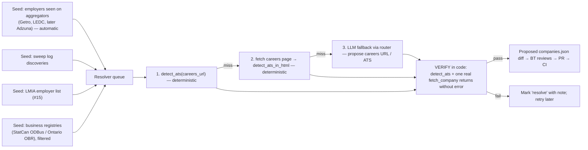

# ADR-002 — Company discovery + resolver (and where an LLM is allowed)

- **Status:** PROPOSED — awaiting BT's decision
- **Date:** 2026-09-21
- **Deciders:** BT (owner)
- **Related:** ADR-001 (workflow), issues #5, JB-30, JB-31, JB-32

## 1. Context — the evidence
Compared the daily sweep's 7+ roles from its last three runs (Sep 17, 18, 21 = 19 roles) with the live board:

| Bucket | Roles | Meaning |
|---|---|---|
| Found by the board | 1 | Xanadu (via MaRS) |
| In registry, unresolved | 1 | Vital Bio (Teamtailor — no adapter) |
| On a board we fetch, missed | 1 | Pipetel (Communitech) → JB-30 |
| **Employer unknown to the board** | **16** | Corvita, Hitachi Rail, Generac, ecobee, Zebra, ASSA ABLOY, Ultra Maritime, Nokia, Sciemetric, Semtech, PerkinElmer, Wellspect, AMD, Per Vices, Adtran |

The board can only fetch employers it knows **and** can reach. Two separate problems:
1. **Discovery** — which employers exist and hire people like the user? (the list)
2. **Resolution** — for each employer, how do they post jobs? (ATS + slug, or a scrape recipe)

Resolution is the hard, reusable part. Discovery lists are interchangeable inputs.

## 2. Decision (proposed)

### 2.1 Seeds → resolver → registry


**Seeds are ranked by yield, not size.** A business registry lists every company that exists (mostly not
hiring engineers, no careers URL, often no website). Employers *already seen posting* relevant jobs on an
aggregator are pre-qualified. So: aggregator-seen employers first (free, automatic every run), sweep log
second, LMIA third, registries last and filtered (industry code + corridor) to keep the queue small.

**BT, 2026-09-21 — every company is in scope; "hiring" is a filter, not a gate.** Nothing is excluded
for not hiring engineers today: every resolved company is tracked, and the board/map filter by hiring status
(the map already has `fit` / `open` / `none` / `unknown`). The yield ranking above only sets the **order** in
which the resolver works through the queue. The real limit is resolution effort per company, not filtering.

**Channel coverage — "if they don't post on Job Bank, we need to know why".** Posting on Job Bank is not
mandatory for most employers (it is required as part of LMIA recruitment). So for each company the resolver
records **which channels it posts on** — own ATS, Getro, LEDC, Job Bank, LinkedIn (seen by the sweep) —
as a `channels` field. "Why not on Job Bank" then becomes data, not a guess. The Job Bank open dataset is
monthly CSV from ESDC (latest: August 2026) with title, NOC, NAICS, location, salary — but employer name is
not consistently included, so it is better for market analytics than as a seed. Live Job Bank access
(terms of use, any official feed) needs a spike before building (JB-33).

Registry access (to verify before building): the Ontario Business Registry offers data through a partner
portal rather than, as far as we can tell, a free bulk download; Statistics Canada's Open Database of
Businesses is openly downloadable. Neither carries careers URLs — every entry still needs the resolver.

### 2.2 Where an LLM is allowed
**The daily Action stays LLM-free and deterministic** (north star: near-zero cost; also the Action cannot
reach a local Ollama). The LLM is used **only in the resolver**, which:
- runs on BT's machine, on demand, in batches (slow is fine),
- runs **once per company** — the result is cached in `companies.json`, so cost does not recur,
- is never trusted: **"LLM proposes, code verifies."** An LLM suggestion is accepted only if
  `detect_ats` recognises it AND one real `fetch_company` call succeeds. Output is a diff BT reviews.

### 2.3 LLM router
Order: **Groq free tier** (already used by Aider; fast) → **Gemini free tier** (if a key is set) →
**Ollama local** (several models, slow, always available offline). A provider is skipped on missing key,
HTTP error, timeout, or unparseable output. Interface is one function so providers are swappable:
```python
def ask(prompt: str, schema: dict, timeout_s: int = 60) -> dict | None: ...
```
Keys from environment variables only; never committed (`.gitignore` already blocks `.env`).

## 3. Consequences
- The board's coverage grows **permanently** with every resolved company, at zero daily cost.
- The sweep becomes a discovery input, not a competitor; the board can later replace the sweep's daily loop.
- New adapters are prioritised by data: the resolver counts how many companies sit on each unsupported ATS
  (teamtailor, ultipro, ttcportals, …) — build the adapter with the most companies behind it.
- Given up: fully automatic discovery (BT reviews each resolver diff). Deliberate — wrong slugs are worse
  than missing ones.

## 4. Build sequence (each = one brief in docs/briefs/, one issue, one PR)
1. **JB-5a** `detect_ats` / `detect_ats_in_html` — pure functions (brief written).
2. **JB-5b** resolver script, deterministic stages only, runs on the 22 `resolve` companies → diff.
3. **JB-31a** seed from aggregator-seen employers (build_board already lists `discovered` companies).
4. **JB-31b** LLM router (`ask()`), Groq → Gemini → Ollama, with fixtures in tests.
5. **JB-31c** resolver stage 3 (LLM fallback) using the router.
6. **JB-32** Adzuna spike — an aggregator that adds both jobs and new seeds.

## 5. Decision
> _To be filled in by BT: accept / change / reject, and date._
