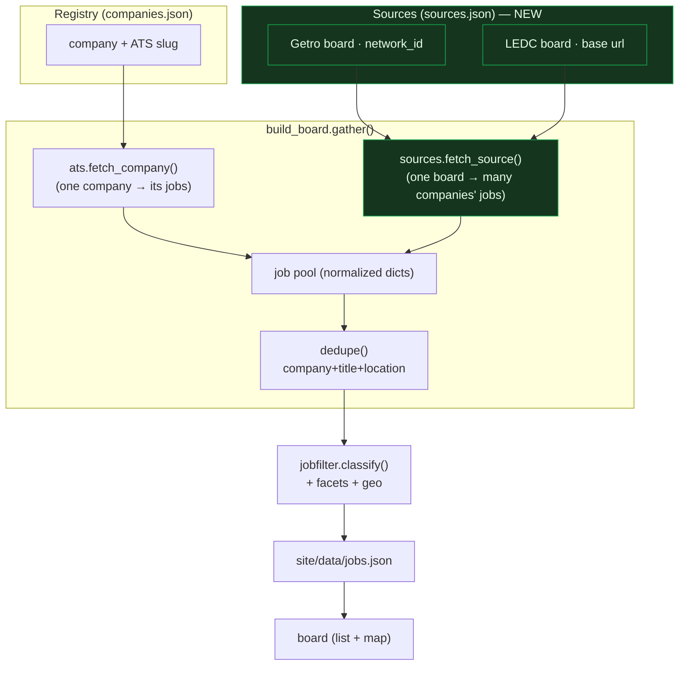
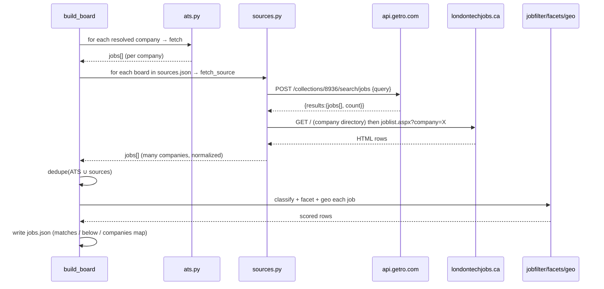

# Design — Board-Source Fetchers (Coverage)

**Issues:** JB-3 (resolve companies), JB-5 (see all available jobs) · **Type:** `type:feature area:engine` · **Status:** design for review

---

## 1. Abstract

The engine today is **company-centric**: one registry line → one ATS adapter → that company's jobs.
It only reaches companies whose careers page sits on an auto-probeable ATS (Greenhouse, Lever, Ashby,
BambooHR, Rippling). Probing proved that most of BT's *fit* companies (Vital Bio, Cloud DX, Nicoya,
StarFish, Palitronica, KA Imaging…) are **not** on those platforms, so the board looks empty of the
roles that matter. That is the "we still don't have a working model" gap.

The fix is a second, **source-centric** tier: local/regional **job-board aggregators** that already
collect these companies' postings regardless of ATS. One aggregator call returns jobs from *many*
companies. This is still deterministic, near-zero-token Python — no LLM in the loop.

Two real sources, both probed and confirmed on 2026-09-17:

| Source | Platform | Transport | Coverage | Fragility |
|---|---|---|---|---|
| **Communitech** | Getro | JSON API (`api.getro.com`) | KW corridor tech (broad) | Low — stable JSON |
| **LEDC** — londontechjobs.ca, londonmfgjobs.com | Custom ASP.NET | Server-rendered HTML | London home market | Medium — HTML scrape |

---

## 2. System diagram — where the new tier sits



The new pieces (green) are **additive** — `ats.py` and the company loop are untouched. Both tiers
emit the *same* normalized job dict, so everything downstream (dedupe, scoring, facets, map) is unchanged.

---

## 3. Data-flow — a single build run



---

## 4. Contract — `engine/sources.py`

New module, mirrors `ats.py`. Only stdlib + `requests` (no new heavy deps; HTML parsed with
stdlib `html.parser`). Every adapter is **failure-safe**: a broken board returns `[]`, never kills the run.

### 4.1 Normalized output (identical to ats.py `_norm`)

```python
{
  "company": str, "title": str, "location": str, "url": str,
  "posted": str|None, "description": str, "salary": str, "source": str,
  # optional enrichments sources can supply directly (skip heuristics when present):
  "arrangement": "onsite"|"hybrid"|"remote"|None,   # Getro work_mode
  "lat": float|None, "lng": float|None,             # Getro location_details point
  "industry": str|None,                             # Getro industry_tags[0]
}
```

`build_board` uses the optional fields when present and falls back to `facets`/`geo` when `None`
(so ATS jobs behave exactly as today).

### 4.2 `fetch_getro(name, network_id, queries) -> list[dict]`

**Endpoint (confirmed):**
```
POST https://api.getro.com/api/v2/collections/{network_id}/search/jobs
headers: {"Content-Type":"application/json", "Accept":"application/json"}   # Accept REQUIRED (else 406)
body:    {"hitsPerPage": 100, "page": 0, "query": "<kw>"}
```
**Response (confirmed):** `{"results": {"jobs": [ … ], "count": N}}`, each job:
```json
{
  "title": "…", "url": "https://…",
  "organization": {"name": "KPMG Canada", "industry_tags": ["…"], "slug": "…"},
  "searchable_locations": ["Toronto, ON, Canada", …],
  "location_details": [{"name":"Toronto, ON, Canada","point":"POINT (-79.383 43.653)"}],
  "work_mode": "on_site" | "remote" | "hybrid",
  "compensation_amount_min_cents": 7300000, "compensation_amount_max_cents": 10200000,
  "compensation_currency": "CAD", "compensation_period": "year", "compensation_public": true,
  "created_at": 1787210687, "skills": ["…"], "seniority": "…", "has_description": true
}
```
**Mapping:**
- `company` ← `organization.name`
- `title`, `url` ← direct
- `location` ← `searchable_locations[0]`; `lat`/`lng` ← parse `location_details[0].point` `"POINT (lng lat)"`
- `arrangement` ← `{on_site:onsite, remote:remote, hybrid:hybrid}[work_mode]`
- `salary` ← if `compensation_public`: `"$73,000–$102,000 CAD/year"` from the cents fields
- `posted` ← `datetime.utcfromtimestamp(created_at).isoformat()`
- `description` ← `""` (search payload omits body; score on `title` + `skills` + `seniority`) → set `description = " ".join(skills)`
- `industry` ← `organization.industry_tags[0]` if any
- `source` ← `"getro:{name}"`

**Query strategy:** the search is relevance-ranked, so run a small keyword set derived from the profile
(titles + top skills: `embedded, firmware, PCB, hardware, electronics, altium, FPGA…`), merge, and dedupe
by `id`. Empty registry/profile → a default corridor set. `queries` defaults to that set.

**Communitech:** `network_id = 8936`.

### 4.3 `fetch_ledc(name, base) -> list[dict]`  ✅ built

**Paginated HTML scrape (confirmed 2026-09-17 — simpler than the directory route first assumed):**
`GET {base}/joblist.aspx?page=N` returns all recent jobs, **50 per card-block per page**; loop `page=1,2,…`
until a page has < 50 cards or yields no new rows (safety cap `max_pages=20`). The `?keyword=` param is
ignored server-side, so we fetch all and let **our own scorer** filter — no per-company loop needed.

**Card block (confirmed markup):**
```html
<div class="gm-card"> <a href="job.aspx?jid=UUID"> …
  <h4 class="gm-card-title">Controls Developer</h4>
  <h3 class="gm-card-subtitle">ZTR Control Systems</h3>
  <i class="fa fa-map-marker"></i>London, ON
  <i class="fa fa-clock-o"></i>Sep 14, 2026
```
**Mapping:** `title` ← `h4.gm-card-title`; `company` ← `h3.gm-card-subtitle`; `location` ← text after
`fa-map-marker`; `url` ← `{base}/job.aspx?jid=…`; `posted` ← date after `fa-clock-o`; `description` ← `""`
(detail body not fetched — would be N extra requests); enrichment fields `None` (fall back to `facets`/`geo`).
`source` ← `"ledc:{name}"`. Boards: `https://londontechjobs.ca`, `https://londonmfgjobs.com`.
Parsed by `parse_ledc_cards()` (pure, regex, unit-tested against captured markup). Failure-safe: keeps
whatever pages succeeded.

### 4.4 Registry — `engine/sources.json`

```json
{ "sources": [
  {"platform": "getro", "name": "MaRS",        "network_id": 383},
  {"platform": "getro", "name": "Communitech", "network_id": 8936},
  {"platform": "ledc",   "name": "LEDC Tech",  "base": "https://londontechjobs.ca"},
  {"platform": "ledc",   "name": "LEDC Mfg",   "base": "https://londonmfgjobs.com"}
]}
```
Confirmed working network IDs: **MaRS 383, Communitech 8936**. Others (Ottawa, Volta, western boards)
are added one confirmed line at a time — see `docs/research/REGIONAL_JOB_BOARDS.md` for the landscape
and the 2-minute confirm-and-add method. Each new region is a **data change, not a code change**.
`FETCH_SOURCES = {"getro": fetch_getro, "ledc": fetch_ledc}`.
`fetch_source(entry)` dispatches by `platform`, returns `(jobs, error_or_None)` — same shape as
`ats.fetch_company`.

### 4.5 `build_board.gather()` change

After the existing company loop, add:
```python
for entry in sources.load_sources():
    got, err = sources.fetch_source(entry)
    if err: errors.append({"company": entry["name"], "error": err})
    for j in got:
        j.setdefault("_reg_flags", []); j["_industry"] = j.get("industry") or "other"
    jobs += got
```
Then in the row build, prefer job-supplied `arrangement`/`lat`/`lng` when present:
`arrangement = j.get("arrangement") or facets.arrangement(...)`, and likewise for coords.
`dedupe()` already collapses ATS/source overlaps (same company+title+location key).

---

## 5. Acceptance criteria

- `sources.fetch_getro("Communitech", 8936, ["embedded"])` returns ≥1 normalized job with non-empty
  `company` and `url`, `arrangement` in {onsite,hybrid,remote}, and `salary` formatted when public.
- A bad `network_id` / network error returns `[]` (no exception escapes).
- `fetch_ledc` returns company+title+url rows from the directory; failure-safe.
- `build_board` (live) shows **more matched companies than the ATS-only baseline**, including at least
  some fit companies that were previously invisible; smoke 11/11 and full suite green.
- Facets on Getro jobs come from real fields (arrangement from `work_mode`, salary from cents, coords
  from `point`) — verified on a sample row.

## 6. Failing test (write first)

```python
# tests/test_sources.py
import sources
def test_getro_normalizes_a_job(monkeypatch):
    fake = {"results": {"count": 1, "jobs": [{
        "title": "Embedded Firmware Engineer",
        "url": "https://ex.com/j/1",
        "organization": {"name": "Nicoya", "industry_tags": ["Medical Device"]},
        "searchable_locations": ["Kitchener, ON, Canada"],
        "location_details": [{"name":"Kitchener","point":"POINT (-80.49 43.45)"}],
        "work_mode": "hybrid",
        "compensation_public": True, "compensation_amount_min_cents": 11000000,
        "compensation_amount_max_cents": 13000000, "compensation_currency": "CAD",
        "compensation_period": "year", "created_at": 1787210687, "skills": ["Altium","STM32"],
        "seniority": "senior", "has_description": True}]}}
    monkeypatch.setattr(sources, "_post", lambda *a, **k: fake)
    jobs = sources.fetch_getro("Communitech", 8936, ["firmware"])
    j = jobs[0]
    assert j["company"] == "Nicoya"
    assert j["arrangement"] == "hybrid"
    assert j["lat"] and 43 < j["lat"] < 44
    assert "110,000" in j["salary"] and "CAD" in j["salary"]
    assert "altium" in j["description"].lower()   # skills used as scorable text
```

## 7. Scope / non-goals

- No job **description** body from Getro search (optional later enrichment fetch per job — deferred, it
  costs N extra requests). Scoring on title + skills + seniority is enough to surface and rank.
- Map still registry-anchored (JB-26); source jobs raise a registry company's role/fit counts when the
  name matches. Plotting *unmatched* source companies is a follow-up.
- LEDC step-2 selectors pending a capture spike (§4.3).
- The employer-facing "posting visibility" product (BT's Product 2 idea) is out of scope — iceboxed.
